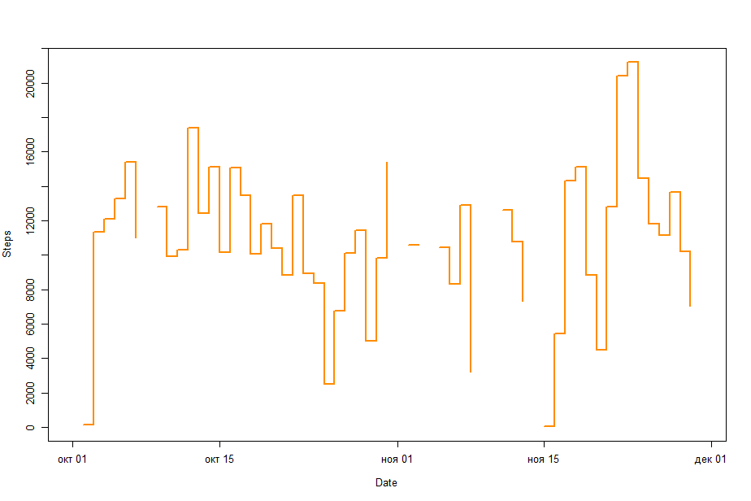
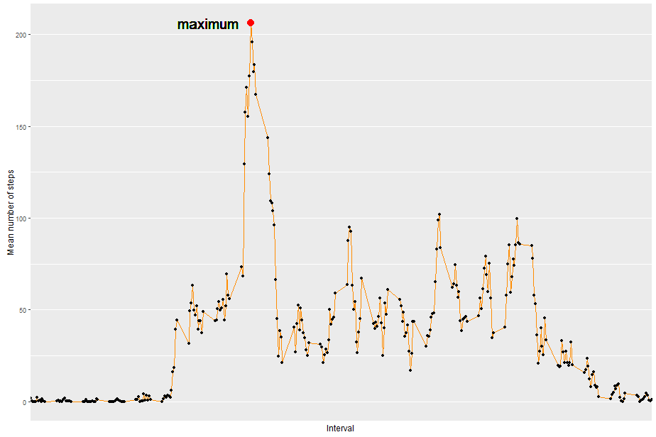
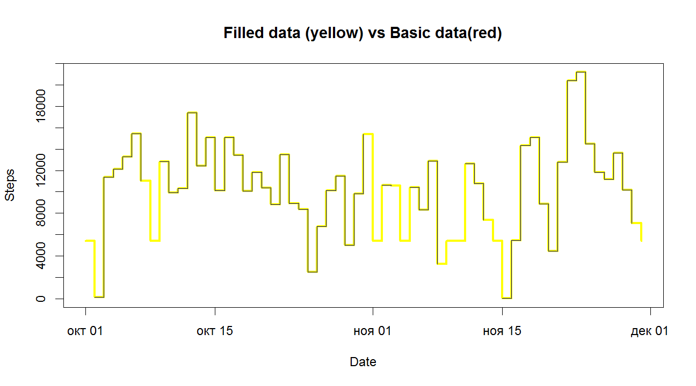
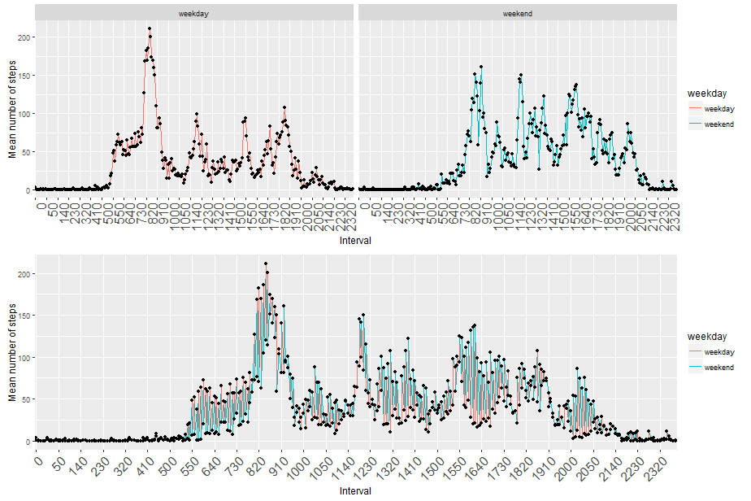

# Course Project 1
Oleh Yashchuk  
13 september 2016 г.  
## Attaching libraries

```r
library(lubridate)
library(ggplot2)
library(dplyr)
library(impute)
library(gridExtra)
```

## 1. Load and preproces the data

```r
activity <- read.csv('./Data/activity.csv')
activity$date <- ymd(activity$date)
```


## 2. Pseudo histogram of the total number of steps taken each day
The total number of steps taken per day.

#### (I deliberately don't exclude NA, because function sum gives 0 when na.rm = TRUE, but 0 is not NA.) 

```r
totalSteps <- activity %>% 
        group_by(date) %>% 
        summarize(total_steps = sum(steps))
```

```r
plot(totalSteps$date, totalSteps$total_steps, 
     type = 's', col = 'darkorange', lwd = 2, lab = c(10, 10, 5),
     xlab = 'Date', ylab = 'Steps')
```

<!-- -->

## 3. Mean and median number of steps taken each day

```r
meanBasic <- mean(totalSteps$total_steps, na.rm = TRUE); meanBasic
```

[1] 10766.19

```r
medianBasic <- median(totalSteps$total_steps, na.rm = TRUE); medianBasic
```

[1] 10765

## 4. Time series plot of the average number of steps taken
The average daily activity pattern

```r
mStepInt <- activity %>% 
        group_by(interval) %>% 
        summarize(mean_steps = mean(steps, na.rm = T))
```

Time series plot of the 5-minute interval and the average number of steps taken across all days

```r
breaksPlot <- levels(factor(mStepInt$interval[seq(1, 
                                    length(mStepInt$interval), 10)]))
```


```r
ggplot(mStepInt, aes(interval, mean_steps, group = 1)) +
        
        geom_line(colour = 'darkorange') + geom_point() + 
        
        geom_point(aes(mStepInt[which(mStepInt$mean_steps == 
                        max(mStepInt$mean_steps)),]$interval,
                        max(mStepInt$mean_steps)), colour = 'red', 
                        lwd = 4) +
        
        geom_text(aes(mStepInt[which(mStepInt$mean_steps == 
                        max(mStepInt$mean_steps)),]$interval,
                        max(mStepInt$mean_steps)), label = 'maximum',
                        hjust  = 1.2, vjust = 0.5, size = 7) +
        
        labs(x = "Interval", y = "Mean number of steps") +
                
        scale_x_discrete(breaks = breaksPlot) +
        
        theme(axis.text.x = element_text(angle = 45, hjust = 1, size = 15)) 
```

<!-- -->

## 5. The 5-minute interval that, on average, contains the maximum number of steps across all the days in the dataset (marked on the plot above)


```r
mStepInt[which(mStepInt$mean_steps == max(mStepInt$mean_steps)),]$interval
```

```
## [1] 835
```

## 6. Code to describe and show a strategy for imputing missing data

The total number of missing values in the dataset shows 'summary' function

```r
summary(activity)
```

```
##      steps             date               interval     
##  Min.   :  0.00   Min.   :2012-10-01   Min.   :   0.0  
##  1st Qu.:  0.00   1st Qu.:2012-10-16   1st Qu.: 588.8  
##  Median :  0.00   Median :2012-10-31   Median :1177.5  
##  Mean   : 37.38   Mean   :2012-10-31   Mean   :1177.5  
##  3rd Qu.: 12.00   3rd Qu.:2012-11-15   3rd Qu.:1766.2  
##  Max.   :806.00   Max.   :2012-11-30   Max.   :2355.0  
##  NA's   :2304
```

For changeover of the missed data the method kNN with k = 5 is used 

#### activityFill - is a new dataset that is equal to the original dataset but with the missing data filled in.


```r
activityFill <- impute.knn(as.matrix(activity[, c(1,3)]), k = 5)$data
activityFill <- as.data.frame(activityFill)
activityFill$date <- activity$date
activityFill$interval <- as.factor(activityFill$interval)
```

## 7. Histogram of the total number of steps taken each day after missing values are imputed

Group data

```r
totalStepsFill <- activityFill %>% 
        group_by(date) %>% 
        summarize(total_steps = sum(steps))
```

Histogram of the total number of steps taken each day

```r
plot(totalStepsFill$date, totalStepsFill$total_steps, 
     type = 's', col = 'yellow', lwd = 3, lab = c(10, 10, 5),
     xlab = 'Date', ylab = 'Steps', main = 'Filled data (yellow) vs Basic data(red)')
lines(totalSteps$date, totalSteps$total_steps, 
     type = 's', col = 'darkblue', lwd = 1, lab = c(10, 10, 5),
     xlab = 'Date', ylab = 'Steps', pch = 22, lty = 1)
```

<!-- -->

The mean and median of the total number of steps taken per day

```r
meanFill <- mean(totalStepsFill$total_steps, na.rm = TRUE); meanFill
```

```
## [1] 10061.43
```

```r
medianFill <- median(totalStepsFill$total_steps, na.rm = TRUE); medianFill
```

```
## [1] 10395
```


### the difference from the estimates from the first part of the assignment:
#### in mean -6.55\%
#### in median -3.44\%
#### So imputing missing data on the estimates decrease the total daily number of steps

## 8. Panel plot comparing the average number of steps taken per 5-minute interval across weekdays and weekends

A new factor variable in the dataset with two levels – “weekday” and “weekend” 
indicating whether a given date is a weekday or weekend day.

```r
activityFill$weekday <- ifelse(weekdays(activityFill$date) %in% 
                                       c('суббота', 'воскресенье'), 
                               'weekend', 'weekday')
```

Group data

```r
meanStepsFillWeekday <- activityFill %>% 
        group_by(weekday, interval) %>% 
        summarize(mean_steps = mean(steps))
meanStepsFillWeekday$weekday <- as.factor(meanStepsFillWeekday$weekday)
```

Ploting function

```r
myplot <- function(data, arg1, arg2, ...) {
        ggplot(data, aes(interval, mean_steps, group = 1, colour = weekday)) +
        
        arg1 +
        
        geom_line() + geom_point(colour = c('black')) +
        
        labs(x = "Interval", y = "Mean number of steps") +
        
        scale_x_discrete(breaks = breaksPlot) +
        
        theme(axis.text.x = element_text(angle = arg2, hjust = 1, size = 15))
}
```

Panel plot containing a time series plot of the 5-minute interval and the average number of steps taken, averaged across all weekday days or weekend days. 


```r
sep <- myplot(meanStepsFillWeekday, facet_grid(.~weekday), 90)
un <- myplot(meanStepsFillWeekday, geom_line(), 45)
```


```r
grid.arrange(sep, un, ncol = 1, nrow = 2)
```

<!-- -->

### 9. All of the R code reproduce the results (numbers, plots, etc.) in the report
